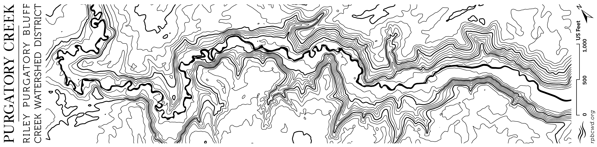

A stylized contour map of the lower section of Purgatory Creek in Eden Prairie, Minnesota. Designed to wrap around an enamel campfire mug. The graphic was first mapped and styled in ArcGIS Pro, then exported into Adobe Illustrator for typographic design and refinement. Created for the Riley Purgatory Bluff Creek Watershed District. 

This mug graphic was created as part of an outreach activity giveaway, where members of the public could participate in a scavenger hunt across the watershed district to earn a prize pack.
## Full Graphic

