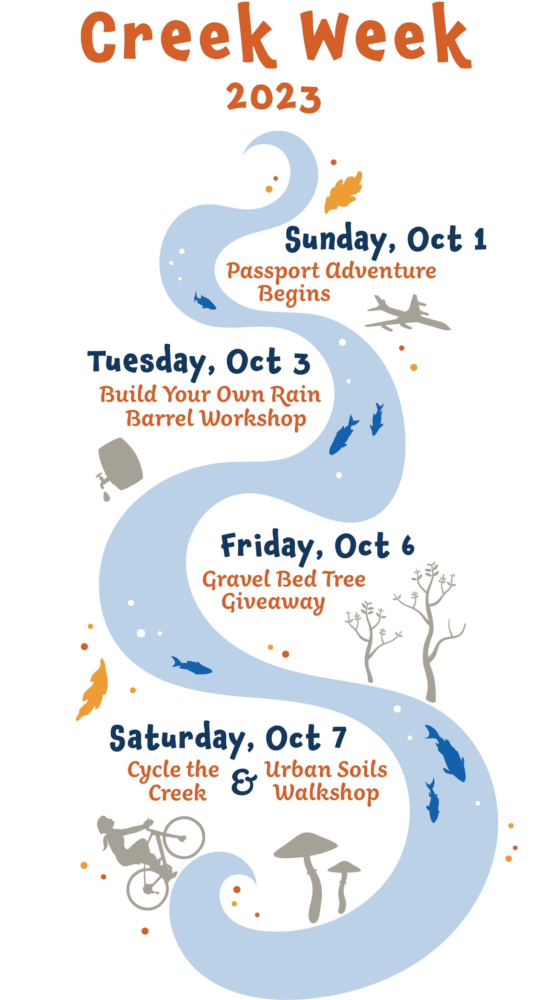

An outreach graphic designed to be an attractive, informative way to communcating events during "Creek Week" at the Riley Purgatory Bluff Creek Watershed District. The graphic was created using Adobe Illustrator and is made up of primarily hand-created original vectors, with the addition of some open-source vectors (trees, plane, oak leaves, fish).

The graphic was used on the District website to promote the week of activities, and was used on flyers which were posted at community locations and given away at events to promote event participation.

## Full Graphic

