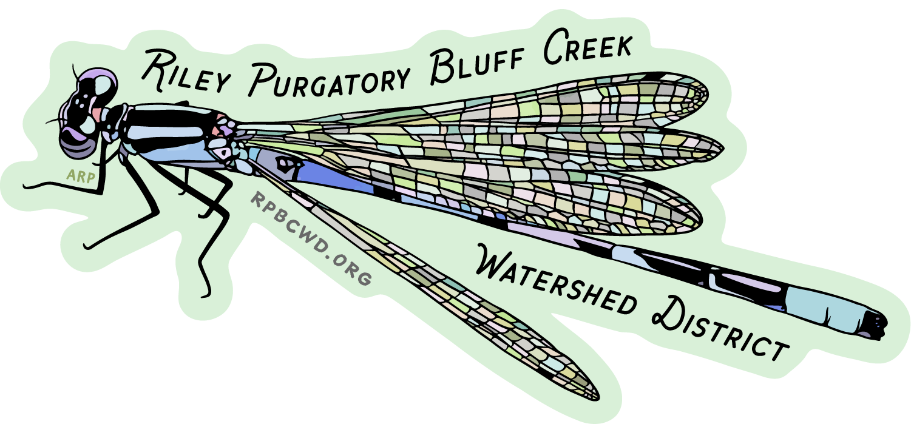
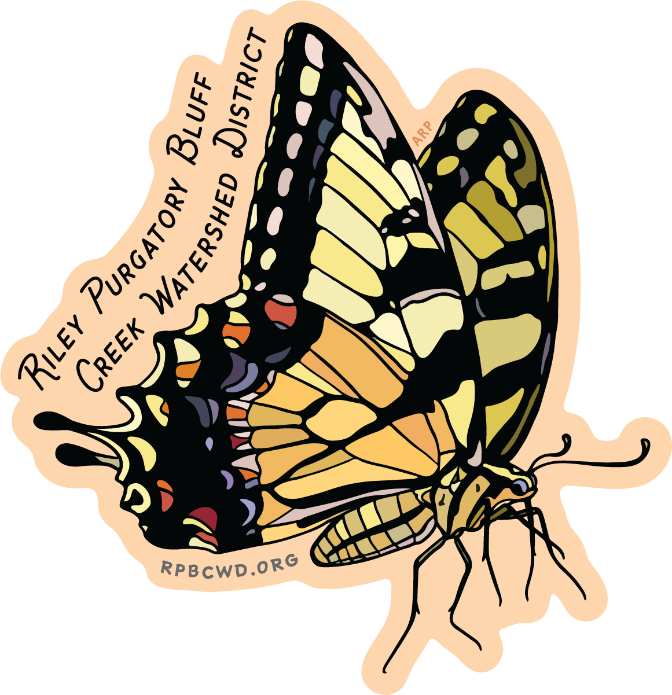
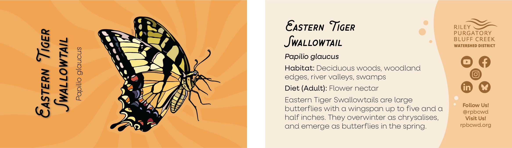
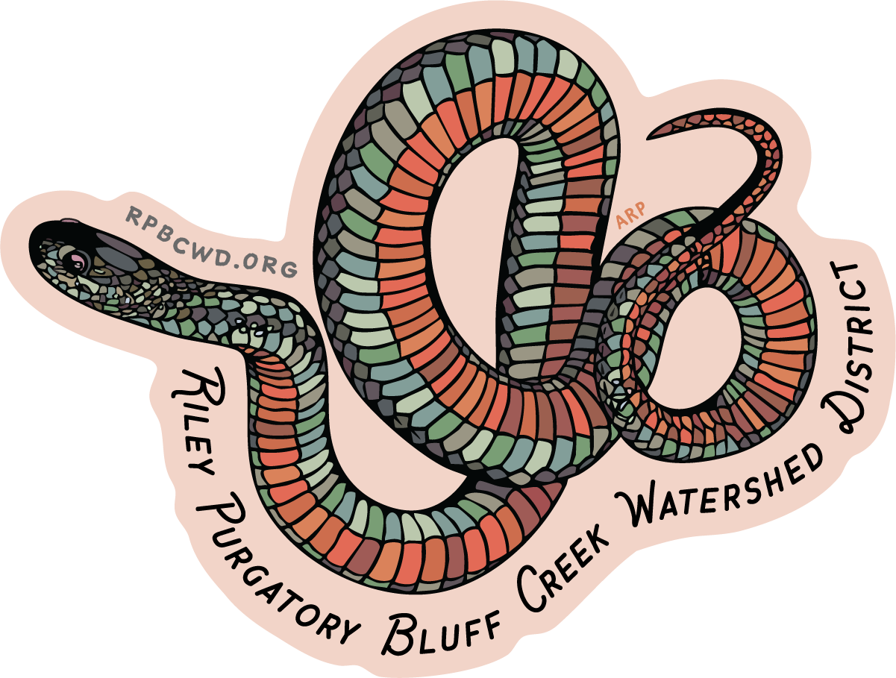
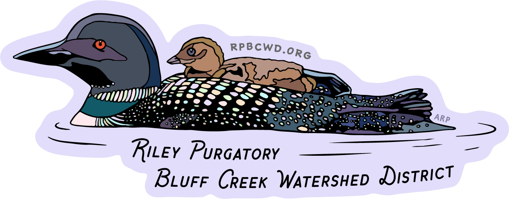
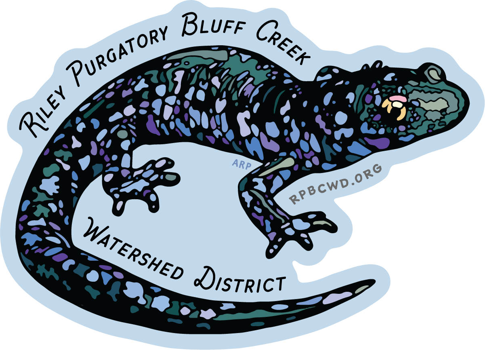
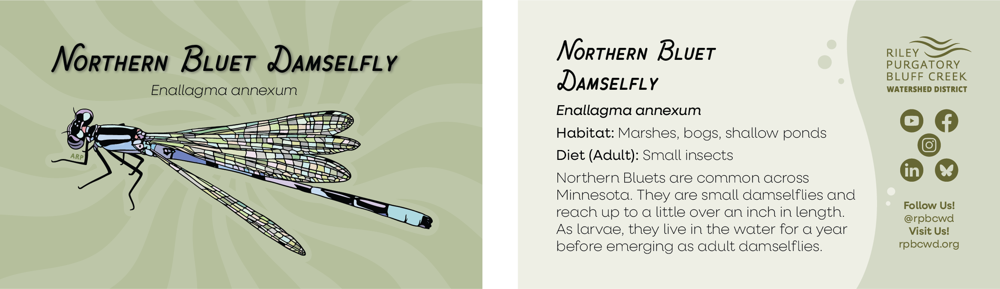
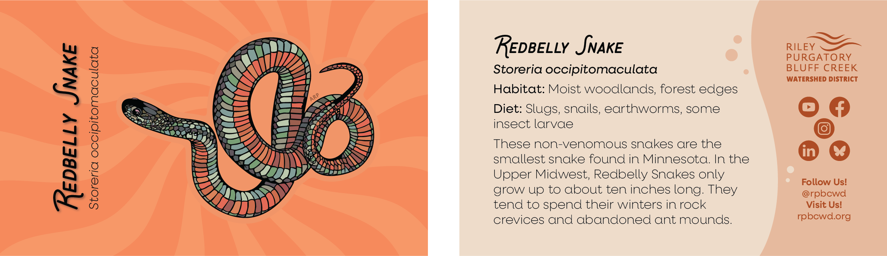
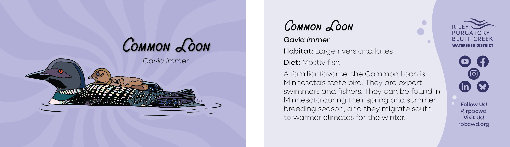
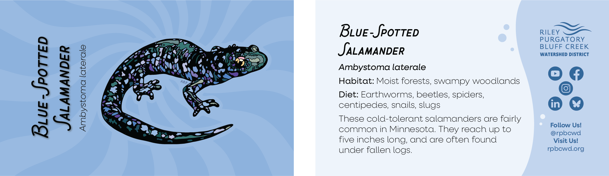

A set of five stickers and informational cards showcasing animals that can be found in Minnesota. The animal graphics were hand-drawn using an iPad, then converted to vector format and loaded into Adobe Illustrator for final sticker and card design and polishing. Created for the Riley Purgatory Bluff Creek Watershed District. 

This sticker and card set was created as an education and outreach tool. The goal was to have attractive stickers that members of the public would want to display, but that also had the watershed district's name prominently shown to increase District visibility. The informational cards would available in conjunction with with the stickers in order to educate members of the public about some animals that they might spot around Minnesota.

# Stickers
### Northern Bluet Damselfly

### Eastern Tiger Swallowtail Butterfly

### Redbelly Snake

### Common Loon

### Blue-Spotted Salamander

# Info Cards

