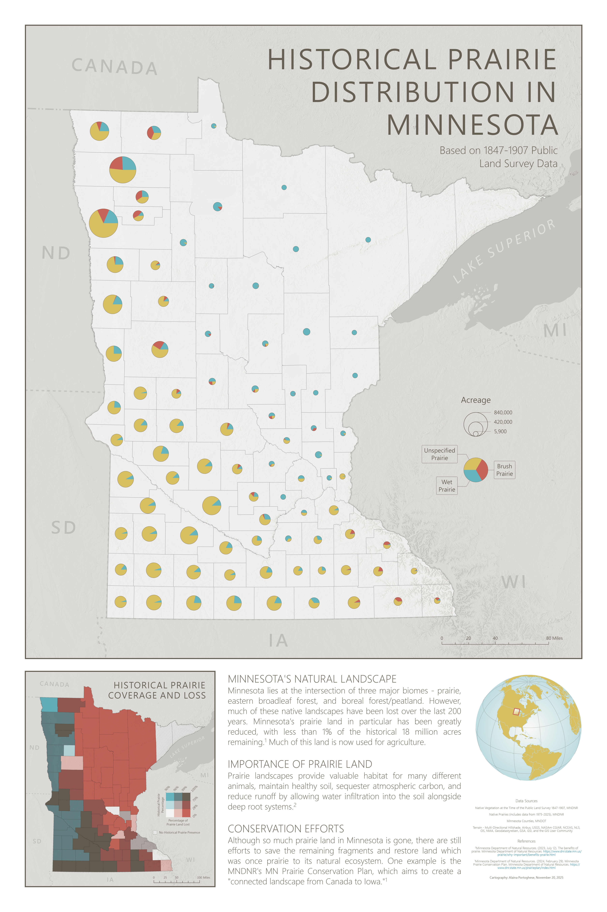

## About

This poster map was created as a final project for a cartography class. It was created in ArcGIS Pro with prairie data from the 1847-1907 Public Land Survey and the Minnesota DNR. It shows historical prairie acreage as graduated pie charts, and a smaller bivariate choropleth map showing percentage of county land that was historically prairie, and percentage of that which has now been lost.