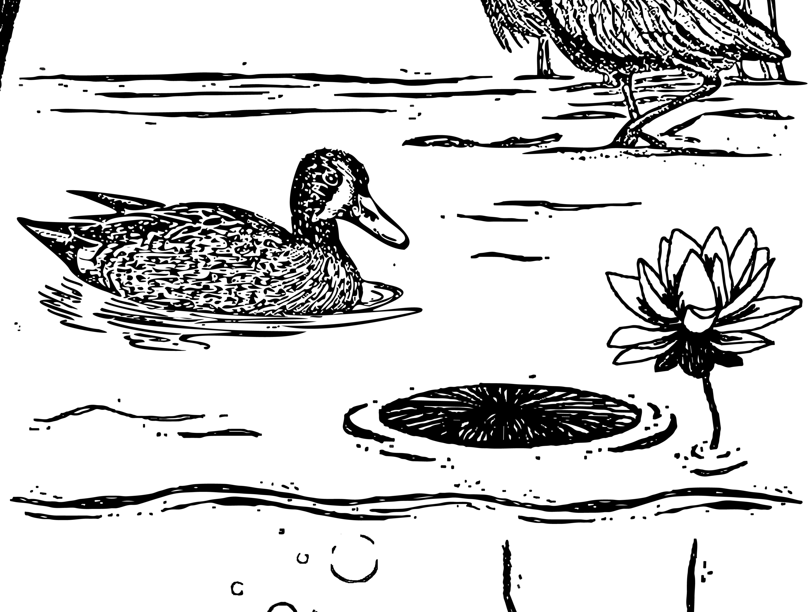
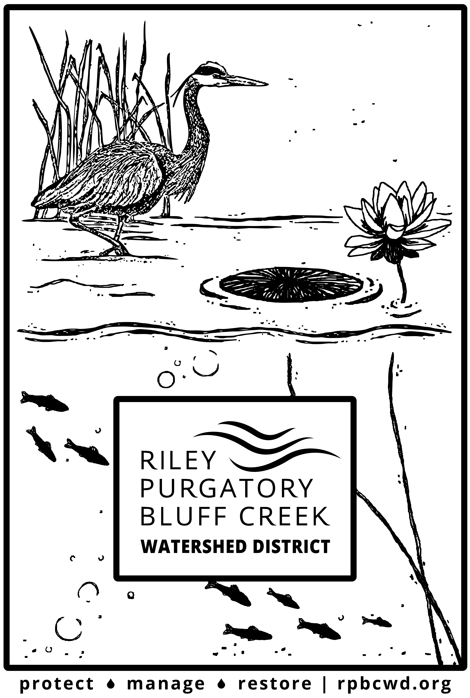
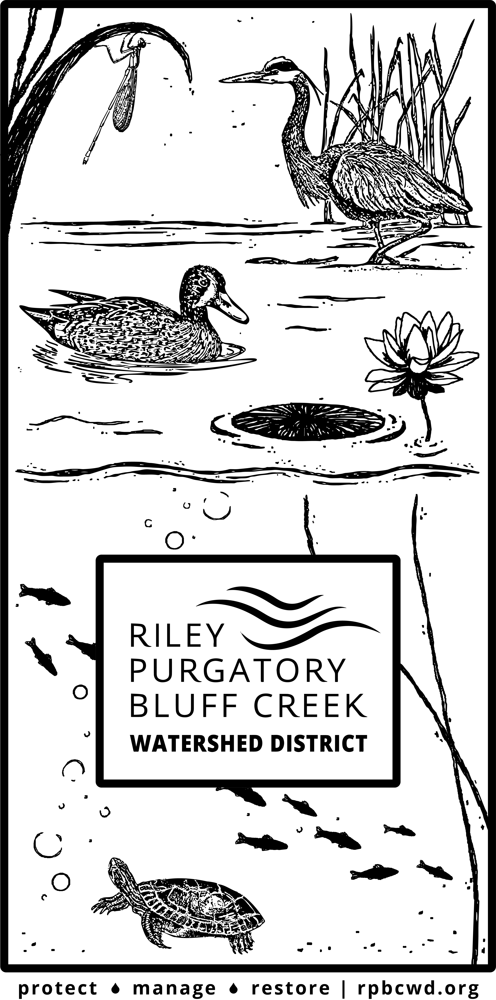

## About

These full vertical and reduced graphics were created in Adobe Illustrator using a mix of hand-drawn details and animals (bubbles, fish, waves, lotus/emergent vegetation) and open-source vectors (heron, turtle, duck, damselfly). Designed for screen printing onto grocery tote bags with different sizes/versions for different bag printing areas. Created for the Riley Purgatory Bluff Creek Watershed District. 

The printed tote bags were created as part of an outreach activity giveaway, where members of the public could participate in a scavenger hunt across the watershed district to earn a prize pack. Bags were also given away at events to improve District visibility.

## Reduced Graphic

## Full Vertical Graphic

